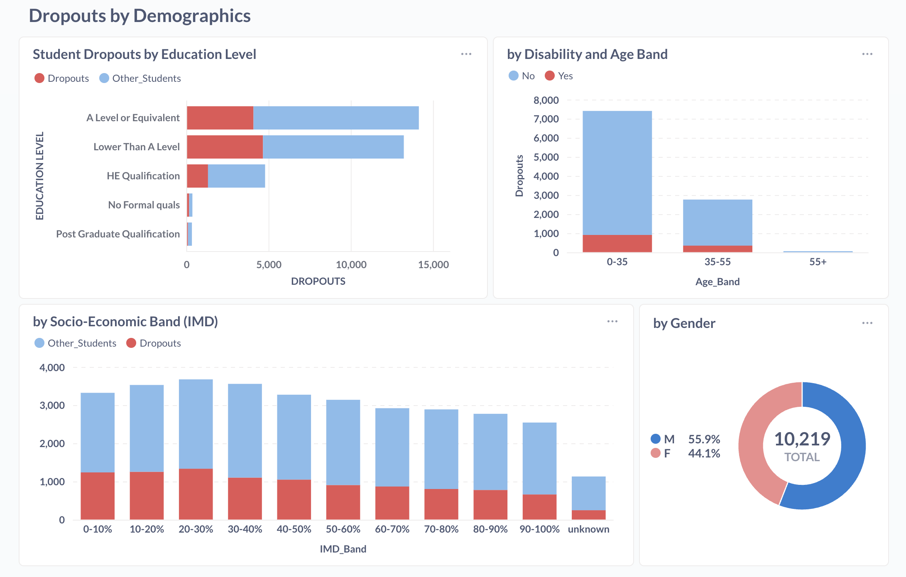

<div align="center">


<h1>Open University Learning Analytics Dataset (OULAD)</h1>

<p>
Presented by Group 1
</p>

</div>

---

# Table of Contents

- [Project Overview](#-about-the-project)
  - [Dataset Used](#dataset-used)
  - [Goal of the Exercise](#goal-of-the-exercise)
  - [Team Setup](#team-setup)
  - [Environment Setup](#environment-setup)
- [Architecture & Workflow](#architecture--workflow)
  - [Pipeline Flow](#pipeline-flow)
  - [Tools Used](#tools-used)
  - [Medallion Architecture](#medallion-architecture)
- [Modeling Process](#modelling-documentation)
  - [Source Structure](#source-structure)
  - [Star Schema Design](#star-schema-design)
  - [Challenges](#challenges)
- [Collaboration & Setup](#collaboration--setup)
  - [Task Splitting](#task-splitting)
  - [Shared vs Local Work](#shared-vs-local-work)
  - [Best Practices Learned](#best-practices-learned)
- [Business Questions & Insights](#business-questions--insights)
  - [Business Questions Explored](#business-questions-explored)
  - [Dashboards / Queries](#dashboards--queries)
  - [Key Insights](#key-insights)

---

## 🌟 About the Project

<div align="center">


</div>

The project uses the **Open University Learning Analytics Dataset (OULAD)**, which contains information about students, courses, assessments, and interactions in a virtual learning environment.

### Dataset Used
Education dataset (**OULAD**)

### Goal of the Exercise
Transform the OLTP schema into a **dimensional star schema** (facts + dimensions) for analytics, and explore insights with Metabase dashboard.

### Team Setup
- **Collaboration style**: divided tasks into ingestion, modeling, visualization, and documentation
- **GitHub** used for version control

### Environment Setup
- Shared **Docker containers** for ingestion and dbt builds
- Local laptops for development and testing
- Sync via shared configs and Git

---

## ⚙️ Architecture & Workflow

### Tools Used
- **Ingestion:** dlt  
- **Modeling:** dbt  
- **Visualization:** Metabase  
- **Collaboration:** Git + GitHub  

### Medallion Architecture


---

## 📊 Modelling Process

Goal is to design a star schema:
- **Fact tables**: actual measures (scores, clicks, etc.)
- **Dimension tables**: descriptive attributes, connected to fact tables (with surrogate keys where possible)

---

## Fact Tables

### `fact_assessments`
> Stores student assessment scores for each module + presentation

| Column            | Type   | Notes / Links                                   |
|-------------------|--------|------------------------------------------------|
| id_student        | INT32  | FK → `dim_student.studentkey`                   |
| id_assessment     | INT32  | FK → `dim_assessment.assessmentkey`             |
| code_module       | STRING | FK → `dim_course.code_module`                   |
| code_presentation | STRING | FK → `dim_course.code_presentation`             |
| date_key          | INT32  | FK → `dim_date.datekey`                         |
| score             | INT32  | Score student got                               |

---

### `fact_vle_interactions`
> Tracks student activity in the VLE (clicks, interactions)

| Column            | Type   | Notes / Links                                   |
|-------------------|--------|------------------------------------------------|
| id_student        | INT32  | FK → `dim_student.studentkey`                   |
| id_site           | INT32  | FK → `dim_vle.vlekey`                           |
| code_module       | STRING | FK → `dim_course.code_module`                   |
| code_presentation | STRING | FK → `dim_course.code_presentation`             |
| date_key          | INT32  | FK → `dim_date.datekey`                         |
| sum_click         | INT32  | Total clicks/interactions                       |

---

## Dimension Tables

### `dim_assessment`
> Additional assessment details

| Column                       | Type   | Notes                         |
|------------------------------|--------|-------------------------------|
| assessmentkey                | INT32  | PK                            |
| code_module                  | STRING | Links to course               |
| code_presentation            | STRING | Links to course               |
| assessment_type              | STRING | TMA, exam, etc.               |
| days_since_code_presentation | INT32  | Days offset from start        |
| weight                       | INT32  | Weight in grade calculation   |

---

### `dim_course`
> Additional module + presentation details

| Column                   | Type   | Notes                                |
|--------------------------|--------|--------------------------------------|
| code_module              | STRING | PK (with code_presentation)          |
| code_presentation        | STRING | PK (with code_module)                |
| module_presentation_length | INT32 | Length of presentation              |

---

### `dim_date`
> Dates breakdown

| Column            | Type   | Notes                       |
|-------------------|--------|-----------------------------|
| code_presentation | STRING | Link to course presentation |
| datekey           | INT32  | PK                          |
| presentation_year | INT32  | Year                        |
| presentation_semester | STRING | Semester (Jan, Oct)     |
| year_completed    | UINT16 | Year completed              |
| months_since_start | INT64 | Months since start          |

---

### `dim_student`
> Student demographics and results

| Column               | Type   | Notes                  |
|----------------------|--------|------------------------|
| studentkey           | INT32  | PK                     |
| gender               | STRING |                        |
| region               | STRING |                        |
| education_level      | STRING |                        |
| imd_band             | STRING | Deprivation index band |
| age_band             | STRING | Age group              |
| num_of_prev_attempts | INT32  | Attempts before        |
| studied_credits      | INT32  | Total credits          |
| has_disability       | BOOL   | Disability status      |
| final_result         | STRING | Pass/Fail/Withdrawn    |

---

### `dim_vle`
> Additional details regarding VLE activities

| Column            | Type   | Notes                     |
|-------------------|--------|---------------------------|
| vlekey            | INT64  | PK                        |
| code_module       | STRING | Link to course            |
| code_presentation | STRING | Link to course            |
| activity_type     | STRING | e.g. forum, quiz          |

---

## Relationships

### fact_assessments
- **id_student** → `dim_student.studentkey`  
- **id_assessment** → `dim_assessment.assessmentkey`  
- **code_module** → shared key, joins `dim_assessment`, `dim_course`, `dim_vle`  
- **code_presentation** → shared key, joins `dim_assessment`, `dim_course`, `dim_date`, `dim_vle`  
- **date_key** → `dim_date.datekey`  
- **score** → main measure for assessment performance  

### fact_vle_interactions
- **id_student** → `dim_student.studentkey`  
- **id_site** → `dim_vle.vlekey`  
- **code_module** → shared key, joins `dim_assessment`, `dim_course`, `dim_vle`  
- **code_presentation** → shared key, joins `dim_assessment`, `dim_course`, `dim_date`, `dim_vle`  
- **date_key** → `dim_date.datekey`  
- **sum_click** → main engagement metric  

### Quick Takeaways
- Both fact tables carry `code_module` + `code_presentation`, which act as **shared foreign keys** across multiple dimensions.

---

## Schema


##  🚧 Challenges

-   **Data Quality**
    -   Many columns stored as nullable strings instead of categorical/numeric (e.g., gender, region, imd_band).
    -   Dates inconsistently typed (strings, integers).
    -   Missing/invalid values like `"?"` in imd_band, week_from/week_to, and score fields.
    -   Redundant/non-informative columns (e.g., constant `is_banked`, pipeline `_dlt_*` artifacts).
    -   Duplicate IDs across tables.
        
-   **Schema & Structure**
    -   Original tables mixed demographics, course, and event data—requiring restructuring into a clean star schema.
    -   Needed to avoid dimension-to-dimension joins for analysis.
        
-   **Collaboration**
    -   Git merge conflicts.
    -   Database connection synchronization issues.
    - Time and schedule constraints 

## 💡OULAD Business Questions

**1. Do demographics influence dropout?**
**2. How does engagement in the VLE impact performance?**
**3. How do age bands affect dropout rates?**
**4. Do students from certain regions or IMD bands perform**
**5. Which assessments (Exam, TMA, CMA) have the highest failure rates?**
**6. Which VLE activity types (forum, quiz, wiki, resource) lead to better performance?**

---
## 🧑‍💻 Sample Queries

**1. Education Level × IMD Band**
```
DROP  TABLE  IF  EXISTS  mart.group1_BQ1;
CREATE  TABLE  mart.group1_BQ1
ENGINE = MergeTree
ORDER  BY  tuple()
AS
SELECT
sd.education_level,
sd.imd_band,
COUNT(*) AS student_count,
SUM(CASE  WHEN m.final_result = 'Withdrawn'  THEN  1  ELSE  0  END) AS dropout_count,
ROUND(100.0 * SUM(CASE  WHEN m.final_result = 'Withdrawn'  THEN  1  ELSE  0  END) / COUNT(*), 2) AS dropout_rate_percent
FROM mart.group1_dim_student_demographics sd
JOIN mart.group1_dim_student_module m ON sd.StudentKey = m.StudentKey
GROUP  BY sd.education_level, sd.imd_band
ORDER  BY dropout_rate_percent DESC;
```

**2.  Assessment Failure Rates**

```
DROP  TABLE  IF  EXISTS  mart.group1_BQ6;
CREATE  TABLE  mart.group1_BQ6
ENGINE = MergeTree
ORDER  BY  tuple()
AS
SELECT
da.assessment_type,
COUNT(*) AS attempts,
SUMIf(1, fa.score < 40) AS fail_count,
ROUND(fail_count * 100.0 / attempts, 2) AS fail_rate_pct,
ROUND(avgIf(fa.score, fa.score IS  NOT  NULL), 2) AS avg_score
FROM mart.group1_fact_assessments fa
JOIN mart.group1_dim_assessment da
ON fa.AssessmentKey = da.AssessmentKey
WHERE fa.score IS  NOT  NULL
GROUP  BY da.assessment_type
```

**3. Disengagement timeline before withdrawal**

```
DROP  TABLE  IF  EXISTS mart.group1_BQ10;
CREATE  TABLE  mart.group1_BQ10
ENGINE = MergeTree
ORDER  BY  tuple()
AS
SELECT
d.months_since_start,
COUNT(DISTINCT vle.StudentKey) AS disengaged_students
FROM mart.group1_fact_vle_interactions vle
JOIN mart.group1_dim_date d ON vle.DateKey = d.DateKey
JOIN mart.group1_dim_student_module sm ON vle.StudentKey = sm.StudentKey
WHERE sm.final_result = 'Withdrawn'
GROUP  BY d.months_since_start
ORDER  BY d.months_since_start;
```
## 📊 Sample Dashboards
---


### Key Insights
- **Dropouts higher among students with A Level or lower qualifications**.
- **Majority of dropouts are under 35; disability slightly increases risk.**
- **Lower socio-economic bands (0–30%) show more dropouts.**
- **Gender distribution is balanced (no strong effect).**
- **Most students pass TMAs & CMAs; very few exam fails.**
- **Higher VLE engagement = higher success; <200 clicks strongly linked to fails/withdrawals.**

---

## 🔑 Key Learnings

### Technical Learnings
- Gained more hands-on experience with **SQL joins** to analyze student engagement and performance.
- Understood the relevance of Schema design for facts and dimensions  

### Team Learnings
-   Strengthened collaboration through **Git version control** when working on shared transformations.
-   Managed dependencies and conflicts in a **Dockerized shared environment**, simulating real engineering workflows.
-   Understood the importance of **clear documentation** for aligning on dataset features (students, assessments, clicks) and processing steps.

### Real-World Connection
-   The OULAD project mirrors industry **ETL/ELT practices**, moving from ingestion (raw CSVs) → cleaning (handling missing values, standardization) → marts (aggregated views for analytics).
-   Showed how learning analytics can provide insights into **student performance, dropout risks, and engagement patterns**, which has direct educational impact.

---

## 🚀 Future Improvements

### Next Steps
-   Add **orchestration tools (Airflow/Prefect)** to schedule and monitor OULAD pipelines.
-   Improve scalability for **larger learning datasets** beyond OULAD (e.g., MOOC data, LMS platforms).

### Generalization
The workflow can be extended to other domains that rely on **event logs and user interaction data**: education (student outcomes), retail (customer behavior), healthcare (patient engagement), and entertainment (viewer preferences).