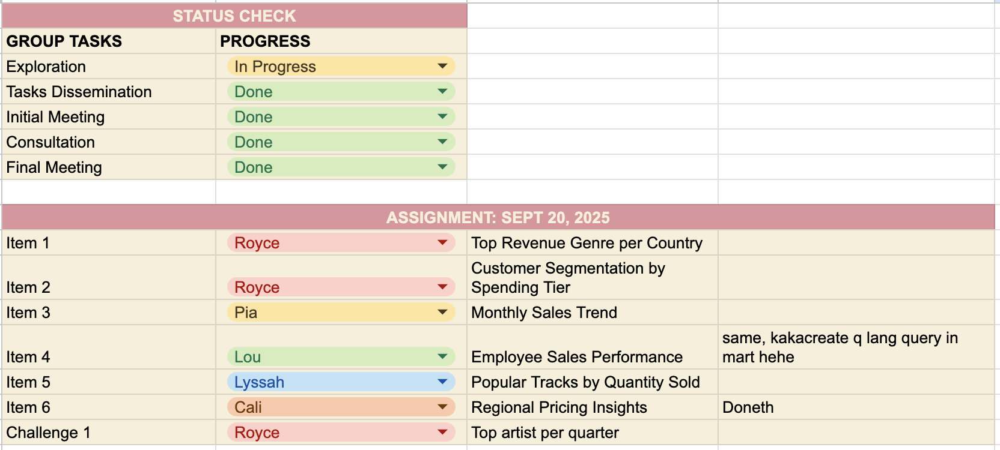

# 🌷 Day 2 – Dimensional Modeling with Chinook
📅 2025-09-27

---

## 1. Ingestion (DLT → RAW layer)
We ingest tables from the Chinook database into ClickHouse.

**Example Pipeline Snippet:**

```
@dlt.resource(write_disposition="append", name="artist_lou_jenner")
def artist():
    """Extract all artists from the Chinook sample DB."""
    conn = get_connection()
    cur = conn.cursor(cursor_factory=RealDictCursor)
    cur.execute("SELECT * FROM artist;")
    for row in cur.fetchall():
        yield dict(row)
    conn.close()

```

**Run Command**
```
docker compose --profile jobs run --rm \
  dlt python extract-loads/02-dlt-chinook-pipeline.py

```
✅ Output: Data is loaded into raw schema, e.g.:
- raw.chinook_lou_jenner___artist_lou_jenner
- raw.chinook_lou_jenner___album_lou_jenner
- raw.chinook_lou_jenner___track_lou_jenner


## 2. Transformation (dbt → CLEAN layer)
We create staging views to standardize, clean, and type-cast raw data.

**Checklist of Cleaned Tables**
- [ ] Albums
- [ ] Artists
- [ ] Tracks
- [ ] Genres
- [ ] Invoices
- [ ] Invoice Line
- [ ] Customers
- [ ] Employees

**Example (Albums):**
```
{{ config(materialized="view", schema="clean", tags=["staging", "chinook"]) }}

SELECT
    MIN(toInt64(album_id)) AS album_id,
    COALESCE(
        initcap(replaceRegexpAll(trim(title), '\\s+', ' ')),
        'Unknown Album'
    ) AS album_title,
    toInt64(artist_id) AS artist_id,
    now() AS cleaned_at
FROM {{ source('raw', 'chinook_lou_jenner___albums_lou_jenner') }}
GROUP BY
    initcap(replaceRegexpAll(trim(title), '\\s+', ' ')),
    artist_id

```

**Run Command**
```
docker compose --profile jobs run --rm   -w /workdir/transforms/02_chinook   dbt build --profiles-dir . --target remote

```

✅ What staging achieves: 
- Deduplication
- Standardized casing (initcap)
- Consistent typing (int, decimal, string)
- Dropping DLT metadata

## 3. Dimensional Model (MART layer → Star Schema)
We design fact and dimension tables.

## Fact Table:
**fact_invoice_line** 
* Grain: one row per invoice line 
* Columns: invoice_line_id, invoice_id, track_id, quantity, price_usd, line_amount

## Dimension Tables:
* dim_track → joins album, artist, genre into one track view
* dim_album
* dim_artist
* dim_genre
* dim_customer (with support_rep_id → employee)
* dim_employee (sales reps, with hierarchy reports_to)
* dim_date (from invoice_date: date_key, year, month, quarter, etc.)

## Relationships:
* Album → Artist
* Track → Album, Genre
* InvoiceLine → Track, Invoice
* Invoice → Customer
* Customer → Employee (support_rep_id)

## 4.Visualization (Metabase)
* Connect to the mart schema.
* Build dashboards: revenue trends, customer segments, employee performance.
* Validate queries match the dimensional model.

## 5. Assignment Queries (Metabase)

**1. Top revenue by genre per country**
```
-- Top Revenue by Genre per Country
DROP TABLE IF EXISTS mart.Item_1_Group_1;
CREATE TABLE mart.Top_Revenue_by_Genre_per_Country_Group_1
ENGINE = MergeTree
ORDER BY tuple()
AS
SELECT country, genre_name, total_revenue
FROM (
    SELECT
        c.country AS country,
        g.GenreName AS genre_name,
        ROUND(SUM(f.LineAmount), 2) AS total_revenue,
        ROW_NUMBER() OVER (PARTITION BY c.country ORDER BY SUM(f.LineAmount) DESC) AS genre_rank
    FROM mart.FactInvoiceLine_Royce f
    JOIN mart.DimCustomer_Royce c ON f.CustomerKey = c.CustomerKey
    JOIN mart.DimTrack_Royce t ON f.TrackKey = t.TrackKey
    JOIN mart.DimGenre_Royce g ON t.GenreKey = g.GenreKey
    GROUP BY c.country, g.GenreName
) AS ranked
WHERE genre_rank = 1
ORDER BY country;
```

**2. Customer segmentation by spending tier**
```
-- Customer Segmentation by Spending Tier
DROP TABLE IF EXISTS mart.Item_2_Group_1;
CREATE TABLE mart.Customer_Segmentation_by_Spending_Tier_Group_1
ENGINE = MergeTree
ORDER BY tuple()
AS
SELECT
    CASE
        WHEN TotalSpend > 50 THEN 'High'
        WHEN TotalSpend BETWEEN 20 AND 50 THEN 'Medium'
        ELSE 'Low'
    END AS spending_tier,
    COUNT(*) AS customer_count
FROM (
    SELECT
        c.CustomerKey,
        SUM(f.LineAmount) AS TotalSpend
    FROM mart.FactInvoiceLine_Royce f
    JOIN mart.DimCustomer_Royce c ON f.CustomerKey = c.CustomerKey
    GROUP BY c.CustomerKey
) AS spending
GROUP BY spending_tier;
```

**3. Monthly sales trend** 
```
CREATE TABLE mart.Item_3_Group_1
ENGINE = MergeTree
ORDER BY tuple()
AS
SELECT
   toDate(toStartOfMonth(`i.invoice_date`)) AS month,
   SUM(line_amount) AS monthly_revenue
FROM mart.fact_invoice_line_pia
WHERE `i.invoice_date` >= addMonths(today(), -24)
GROUP BY month
ORDER BY month;
```

**4. Employee sales performance**
```

SELECT
    e.employee_id                          AS employee_id,
    e.first_name                           AS first_name,
    e.last_name                            AS last_name,
    d.year                                 AS year,
    d.quarter                              AS quarter,
    SUM(f."il.price_usd" * f."il.quantity") AS total_revenue,
    RANK() OVER (
        PARTITION BY d.year, d.quarter
        ORDER BY SUM(f."il.price_usd" * f."il.quantity") DESC
    ) AS employee_rank
FROM mart.fact_invoiceline_lou AS f
INNER JOIN mart.dim_employee_lou AS e 
    ON e.employee_id = f."e.employee_id"
INNER JOIN mart.dim_date_lou AS d 
    ON f."d.date_key" = d.date_key
GROUP BY
    e.employee_id,
    e.first_name,
    e.last_name,
    d.year,
    d.quarter
ORDER BY
    d.year,
    d.quarter,
    total_revenue DESC

```

**5.Popular tracks by quantity sold**

```
SELECT
    t.track_name,
    SUM(f.quantity) AS total_quantity_sold,
    COUNT(*) AS num_invoice_lines,
arrayStringConcat(groupArray(DISTINCT t.album_title), ', ') AS albums,
   arrayStringConcat(groupArray(DISTINCT t.artist_name), ', ') AS artists
FROM mart.FactInvoiceLine_lyssah f
JOIN mart.dim_track_lyssah t
    ON f.track_id = t.track_id
GROUP BY t.track_name
ORDER BY total_quantity_sold DESC
LIMIT 20;
```

**6.Regional Pricing Insights**

```
-- Avg unit price by country --
DROP TABLE IF EXISTS mart.Challenge_6a_Group_1n;
CREATE TABLE mart.Challenge_6a_Group_1n
ENGINE = MergeTree
ORDER BY tuple() AS
SELECT
  c.country,
  COUNT(DISTINCT c.customer_id) AS DistinctCustomers,
  ROUND(AVG(DISTINCT f.UnitPrice), 2) AS AvgUnitPrice,
  ROUND(AVG(DISTINCT f.LineAmount / NULLIF(f.Quantity, 0)), 2) AS AvgUnitPriceCalc -- sanity check
FROM mart.FactInvoiceLine_Calista f
JOIN raw.chinook___customer_calista c
  ON f.CustomerKey = c.customer_id
GROUP BY c.country
ORDER BY AvgUnitPrice DESC
LIMIT 50;
```

```
-- Avg unit price per track by country (example for one track) --
DROP TABLE IF EXISTS mart.Challenge_6b_Group_1n;
CREATE TABLE mart.Challenge_6b_Group_1n
ENGINE = MergeTree
ORDER BY tuple() AS
SELECT
  c.country,
  t.Name AS Track,
  ROUND(AVG(DISTINCT f.UnitPrice), 2) AS AvgPrice
FROM mart.FactInvoiceLine_Calista f
JOIN raw.chinook___customer_calista c
  ON f.CustomerKey = c.customer_id
JOIN mart.DimTrack_Calista t
  ON f.TrackKey = t.TrackKey
GROUP BY c.country, t.Name
ORDER BY c.country, AvgPrice DESC;
```
**CHALLENGE: TOP ARTIST PER QUARTER**

```

```
## TEAM PROCESS 



